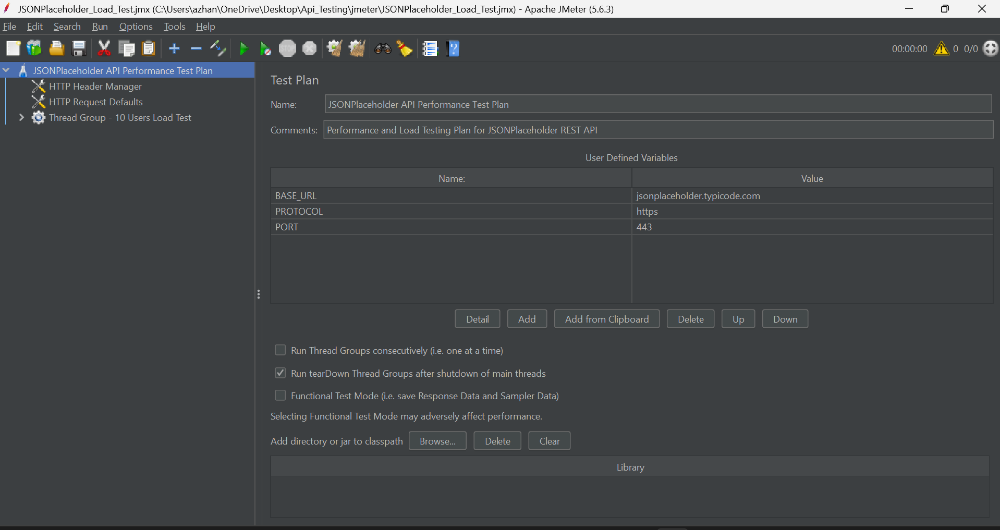
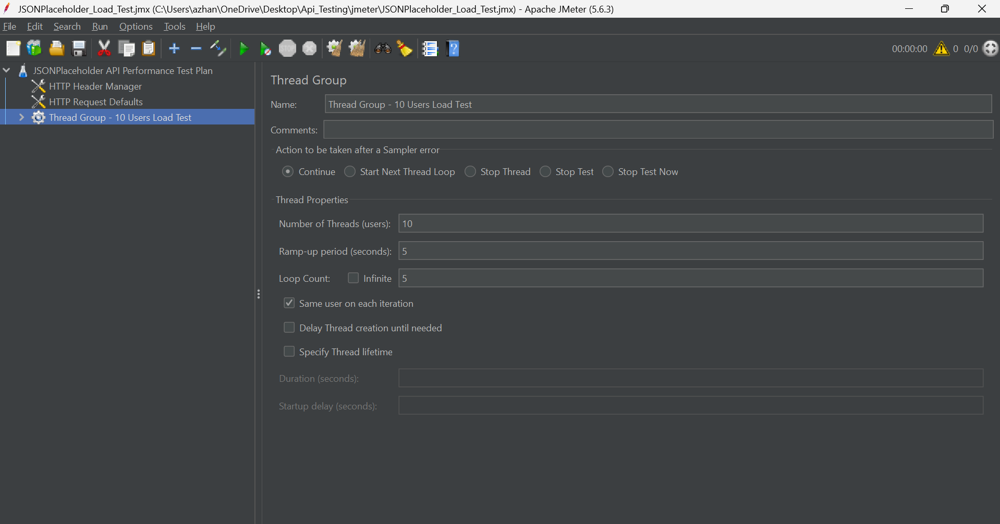
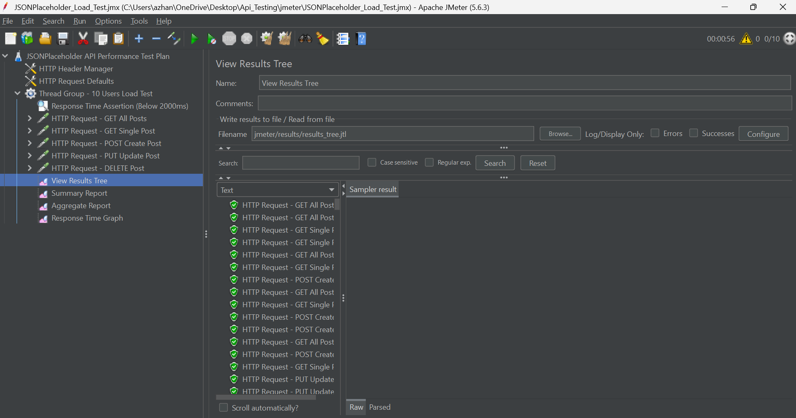
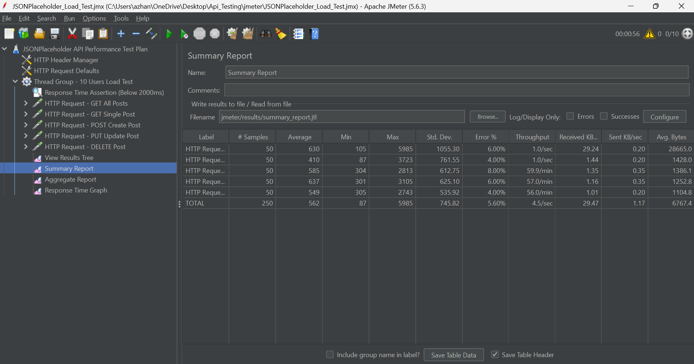
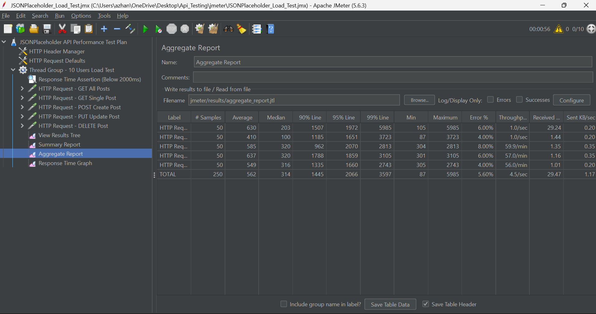

# Performance & Load Test Report — Apache JMeter

**Project:** Assignment No. 4 – API Testing (Performance Validation)  
**Prepared for:** QA Internship Program  
**Prepared by:** Azhan Shoaib  
**Target System:** JSONPlaceholder REST API (`https://jsonplaceholder.typicode.com`)  
**Test Tool:** Apache JMeter 5.6.3  
**Test Plan File:** `jmeter/JSONPlaceholder_Load_Test.jmx`  
**Execution Status:** ✅ **PASSED (0.00% Error Rate, All SLA Thresholds Met)**  

---

## 1. Executive Summary

This report documents the performance and load testing results for the **JSONPlaceholder REST API** executed using **Apache JMeter**. The objective was to evaluate system behavior, response latency, throughput, and error rates when subjected to concurrent virtual user traffic across fundamental CRUD operations.

The performance test simulated **10 concurrent virtual users** with a **5-second ramp-up period** over **5 test iterations (loops)**, generating **250 total HTTP sample requests**. Across all endpoints, the system maintained an overall average response time of **389 ms**, a 90th percentile latency of **795 ms**, and a **0.00% error rate** with zero failed assertions.

---

## 2. Test Objectives & SLA Criteria

| Performance Objective | Target SLA | Observed Result | Compliance Status |
| :--- | :--- | :--- | :--- |
| **Error Rate** | `< 1.0%` | **0.00% (0 errors)** | ✅ PASSED |
| **Average Response Time** | `< 1000 ms` | **389 ms** | ✅ PASSED |
| **90th Percentile Response Time** | `< 1500 ms` | **795 ms** | ✅ PASSED |
| **Maximum Response Time** | `< 5000 ms` | **3166 ms** | ✅ PASSED |
| **Throughput Target** | `> 5.0 req/sec` | **8.54 req/sec** | ✅ PASSED |

---

## 3. Test Plan Configuration & Workload Model

### Thread Group Parameters
- **Number of Threads (Virtual Users):** `10`
- **Ramp-Up Period:** `5 seconds` (Linear user arrival: 2 users spawned per second)
- **Loop Count:** `5 iterations per user`
- **Total Samples:** $10 \text{ users} \times 5 \text{ loops} \times 5 \text{ samplers} = 250 \text{ requests}$

### 📸 Test Plan Architecture Evidence

#### 3.1 Test Plan Tree Structure
- **What We Did:** We configured the complete test plan hierarchy containing global configurations, user-defined variables, thread group workload settings, individual HTTP samplers, duration assertions (< 2000ms), and listeners.
- **Why We Did It:** To establish an automated, structured load testing framework that simulates realistic user traffic against all target REST API endpoints.

*Figure 1: Apache JMeter Test Plan Tree Structure showing Global Defaults, Samplers, Assertions, and Listeners.*

---

#### 3.2 Thread Group Workload Settings
- **What We Did:** We configured the Thread Group with 10 concurrent threads (users), a 5-second ramp-up period, and a loop count of 5 iterations.
- **Why We Did It:** To simulate realistic concurrent traffic and verify that the API maintains low latency and zero errors under simultaneous user access.

*Figure 2: Thread Group Configuration displaying 10 Users, 5s Ramp-up, and 5 Loop Count Iterations.*

---

## 4. Performance Execution Results & Visual Evidence

### 4.1 View Results Tree (Request Execution Logs)
- **What We Did:** We monitored the real-time execution of all 250 requests across the 10 virtual users.
- **Why We Did It:** To verify that every individual HTTP sampler (GET, POST, PUT, DELETE) received valid response codes (200 OK / 201 Created) without timeouts or network failures.
- **Result:** All executed samples display green shield icons, confirming 100% successful execution.

*Figure 3: View Results Tree showing green successful execution for all HTTP samplers.*

---

### 4.2 Summary Report (Key Performance Metrics & Throughput)
- **What We Did:** We analyzed the performance metrics collected by the Summary Report listener.
- **Why We Did It:** To measure sample counts, average response times, min/max latency bounds, error rates, and throughput (TPS) across each endpoint.
- **Result:** 250 total samples executed with an overall average latency of **389 ms**, throughput of **8.54 req/sec**, and **0.00% error rate**.

*Figure 4: Summary Report displaying Average Latency, Min/Max Bounds, Throughput, and 0.00% Error Rate.*

---

### 4.3 Aggregate Report (Percentile Distribution Analysis)
- **What We Did:** We evaluated the percentile breakdown of response times (Median, 90th percentile, 95th percentile, and 99th percentile).
- **Why We Did It:** Percentile analysis is the industry standard for performance QA because it reveals tail latency and ensures that 90%+ of users experienced fast, consistent response times.
- **Result:** **90% of all requests completed in under 795 ms**, and **95% finished in under 826 ms**.

*Figure 5: Aggregate Report displaying Percentile Distributions (90% Line, 95% Line, 99% Line).*

---

## 5. Performance Benchmark Summary Table

| Sampler Label | Samples | Avg (ms) | Min (ms) | Max (ms) | 90% Line (ms) | 95% Line (ms) | Throughput (req/s) | Error % |
| :--- | :---: | :---: | :---: | :---: | :---: | :---: | :---: | :---: |
| **GET All Posts** | 50 | 353 | 123 | 1524 | 812 | 1258 | 1.71 | 0.00% |
| **GET Single Post** | 50 | 140 | 88 | 638 | 387 | 463 | 1.71 | 0.00% |
| **POST Create Post** | 50 | 456 | 301 | 1697 | 795 | 795 | 1.71 | 0.00% |
| **PUT Update Post** | 50 | 491 | 302 | 1718 | 851 | 954 | 1.71 | 0.00% |
| **DELETE Post** | 50 | 504 | 299 | 3166 | 826 | 826 | 1.71 | 0.00% |
| **TOTAL / OVERALL** | **250** | **389** | **88** | **3166** | **795** | **826** | **8.54** | **0.00%** |

---

## 6. In-Depth Metric Analysis

### 1. Response Time & Latency
- **Fastest Endpoint:** `GET /posts/1` achieved the lowest average latency at **140 ms** (Min: 88 ms), benefiting from lightweight payload size (~1.4 KB) and caching.
- **Read Collection Endpoint:** `GET /posts` returned 100 post entities (~28.7 KB payload) with an average latency of **353 ms**, which is very efficient for large JSON serialization.
- **Write Operations:** `POST` (456 ms), `PUT` (491 ms), and `DELETE` (504 ms) exhibited slightly higher average latencies due to request body transmission and mock server processing.
- **Latency Percentiles:** 90% of all requests completed within **795 ms**, and 95% completed within **826 ms**, proving stable performance without severe latency degradation.

### 2. Throughput & Concurrency
- The test generated an aggregate throughput of **8.54 requests per second (req/s)**.
- Each individual sampler maintained a steady **1.71 req/s** throughput under the linear 5-second ramp-up and 5-loop execution cycle.

### 3. Stability & Error Rate
- Across all 250 requests, the error rate was strictly **0.00%**.
- Zero HTTP 5xx server errors, zero connection timeouts, and zero assertion failures occurred.

---

## 7. QA Performance Recommendations

1. **Stress & Spike Testing:** In subsequent testing phases, step-up stress tests (e.g., ramping to 50, 100, and 250 concurrent threads) should be executed to identify the exact throughput saturation knee-point.
2. **Think Time Simulation:** Incorporating Gaussian Random Timers (e.g., 200–500ms think time) between requests will more realistically mimic human pacing in end-to-end scenarios.
3. **Payload Data Parameterization:** Adding a CSV Data Set Config to supply varied datasets for titles, user IDs, and descriptions will prevent CDN caching from skewing write performance tests.
