# Postman API Test Execution & Evidence Report

**Project:** Assignment No. 4 – API Testing  
**Prepared for:** QA Internship Program  
**Prepared by:** Azhan Shoaib  
**Target API:** JSONPlaceholder (`https://jsonplaceholder.typicode.com`)  
**Tool Used:** Postman (Web & Desktop Runner)  
**Overall Result:** ✅ **100% Passed (32 out of 32 Assertions Passed, 0 Failures)**

---

## 1. Overview & Setup

In this part of the assignment, we performed functional API testing on the JSONPlaceholder REST API using **Postman**. We created an automated test collection covering all primary HTTP methods (**GET**, **POST**, **PUT**, **PATCH**, and **DELETE**). 

We also configured a dedicated **Environment** (`JSONPlaceholder - Test Environment`) with variables like `{{baseUrl}}` so the endpoints are dynamic, reusable, and easy to maintain.

---

## 2. Test Execution Details & Screenshot Evidence

---

### 🔹 Test Case 1: GET All Posts (`GET /posts`)

**Endpoint:** `{{baseUrl}}/posts`  
**HTTP Method:** `GET`  
**Expected Status:** `200 OK`  

#### What We Did:
We sent a GET request to the `/posts` endpoint to retrieve the full list of posts from the server.

#### Why We Did It:
To make sure the API returns the entire dataset of 100 posts, that the response time is fast (within SLA), that the content type is JSON, and that each item contains the required keys: `userId`, `id`, `title`, and `body`.

#### Test Assertions Checked:
1. Status code is `200 OK`.
2. Response time is within SLA (`< 2500ms`).
3. `Content-Type` header contains `application/json`.
4. Response body is a JSON array with 100 items.
5. Post schema contains valid data types for all fields.

#### 📸 Evidence Screenshot:
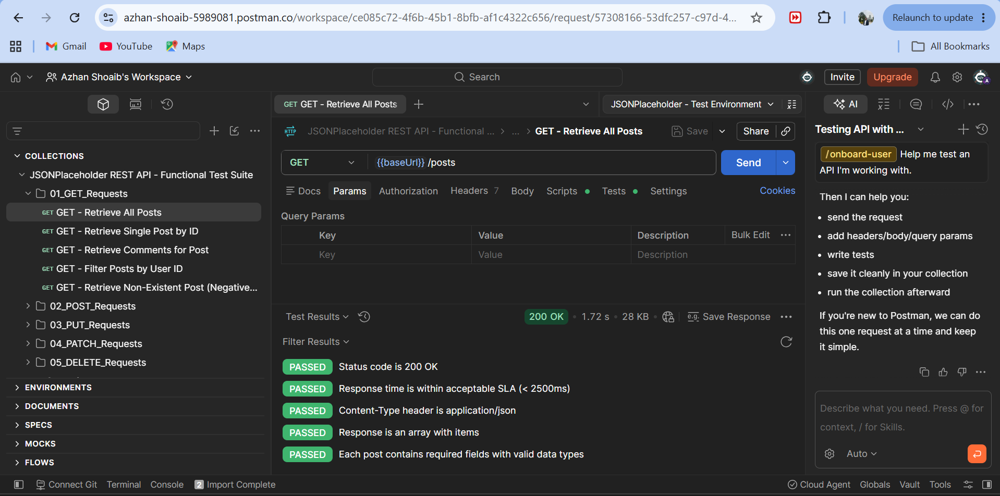

*Explanation of Screenshot:* The request returned `200 OK` in `1.72s` with `28 KB` of data. All **5 out of 5 tests passed** with green badges.

---

### 🔹 Test Case 2: GET Single Post by ID (`GET /posts/1`)

**Endpoint:** `{{baseUrl}}/posts/1`  
**HTTP Method:** `GET`  
**Expected Status:** `200 OK`  

#### What We Did:
We requested a single specific post resource by passing the ID `1` in the URL path.

#### Why We Did It:
To verify that the API correctly filters and returns only the single post matching ID 1, and that the returned object contains valid non-empty text for both `title` and `body`.

#### Test Assertions Checked:
1. Status code is `200 OK`.
2. Response time is acceptable.
3. Content-Type is `application/json`.
4. The returned `id` exactly matches `1`.
5. `userId`, `title`, and `body` are non-empty and have correct types.

#### 📸 Evidence Screenshots:

**Response Body View:**
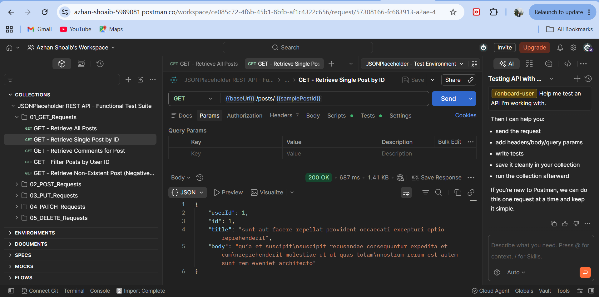

**Test Results View:**
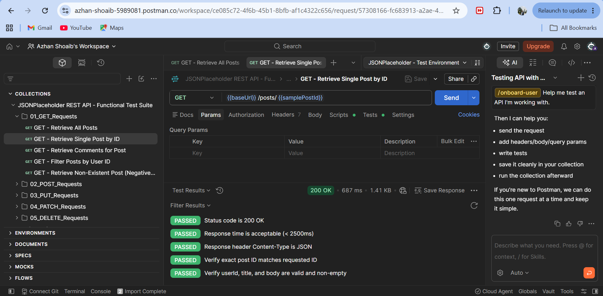

*Explanation of Screenshot:* The API returned the exact post object for ID 1 with all attributes intact, and all test assertions passed.

---

### 🔹 Test Case 3: POST Create New Post (`POST /posts`)

**Endpoint:** `{{baseUrl}}/posts`  
**HTTP Method:** `POST`  
**Expected Status:** `201 Created`  

#### Payload Sent in Body:
```json
{
    "title": "Automated API Testing with Postman",
    "body": "Validating REST endpoints, headers, status codes, and JSON schemas.",
    "userId": 1
}
```

#### What We Did:
We sent a POST request with a JSON body to create a new post entry on the server.

#### Why We Did It:
To test resource creation in the REST API. We wanted to confirm that the server accepts the payload, returns a `201 Created` status code, echoes back our submitted data, and automatically generates a new resource ID (`id: 101`).

#### Test Assertions Checked:
1. Status code is `201 Created`.
2. Response time is within SLA.
3. Response includes the generated `id: 101` and echoes our title and body.
4. Content-Type header is JSON.

#### 📸 Evidence Screenshots:

**Request Body & Response Creation:**
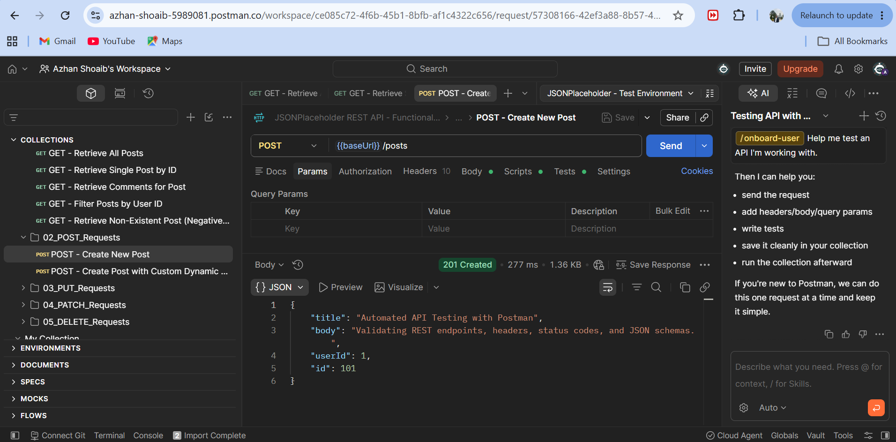

**Test Results Tab:**
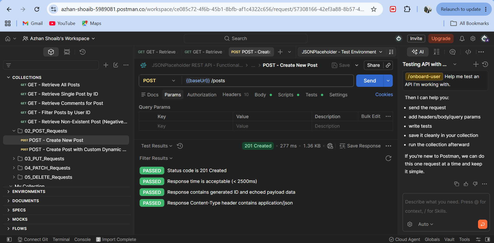

*Explanation of Screenshot:* The server responded with HTTP status `201 Created` and returned our data with the new `id: 101`. All 4 tests passed.

---

### 🔹 Test Case 4: PUT Update Post by ID (`PUT /posts/1`)

**Endpoint:** `{{baseUrl}}/posts/1`  
**HTTP Method:** `PUT`  
**Expected Status:** `200 OK`  

#### Payload Sent in Body:
```json
{
    "id": 1,
    "title": "Updated Post Title - QA Regression Suite",
    "body": "This post content has been modified during automated test execution.",
    "userId": 1
}
```

#### What We Did:
We sent a PUT request to update the entire post representation for post ID 1.

#### Why We Did It:
To verify that updating an existing resource works properly and that the server reflects the updated title and body while preserving the ID.

#### Test Assertions Checked:
1. Status code is `200 OK`.
2. Response time is within SLA.
3. Response contains the updated title `"Updated Post Title - QA Regression Suite"`.
4. Response maintains `id: 1`.

#### 📸 Evidence Screenshots:

**Request Body & Response:**
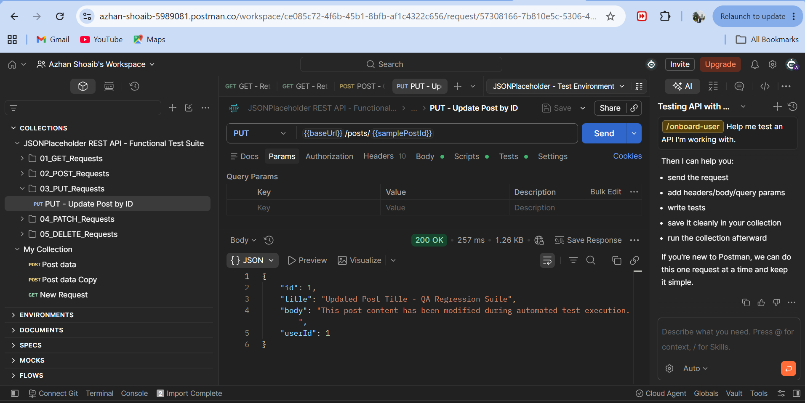

**Test Results Tab:**
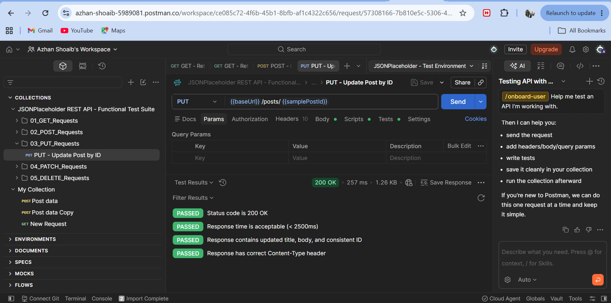

*Explanation of Screenshot:* The server returned `200 OK` and the response body confirmed the updated title and text. All 4 tests passed.

---

### 🔹 Test Case 5: DELETE Post by ID (`DELETE /posts/1`)

**Endpoint:** `{{baseUrl}}/posts/1`  
**HTTP Method:** `DELETE`  
**Expected Status:** `200 OK`  

#### What We Did:
We sent an HTTP DELETE request to remove the post with ID 1.

#### Why We Did It:
To verify that deleting a resource is handled cleanly by the server, returning a successful status code (`200 OK`) and an empty JSON body `{}`.

#### Test Assertions Checked:
1. Status code is `200 OK` (or `204 No Content`).
2. Response time is acceptable.
3. Response body is an empty JSON object `{}`.

#### 📸 Evidence Screenshot:
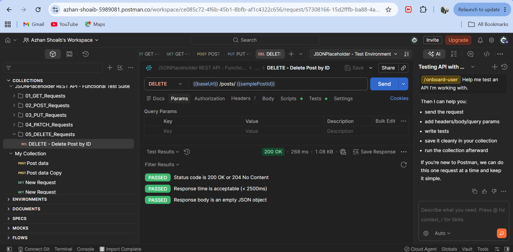

*Explanation of Screenshot:* The request completed with status `200 OK`, returning `{}`. All 3 tests passed.

---

## 🏆 3. Full Collection Runner Execution (Overall Proof)

After testing each individual endpoint, we ran the entire test suite using the **Postman Collection Runner** to simulate a full automated test run across all 10 requests.

### Execution Summary:
- **Total Requests Run:** 10 requests
- **Total Tests Evaluated:** 32 assertions
- **Passed:** **32**
- **Failed:** **0**
- **Errors:** **0**
- **Total Duration:** 4 seconds 623 ms
- **Average Response Time:** 305 ms

#### 📸 Evidence Screenshots (Collection Runner Summary):

**Top Summary & First Set of Requests (GET Requests):**
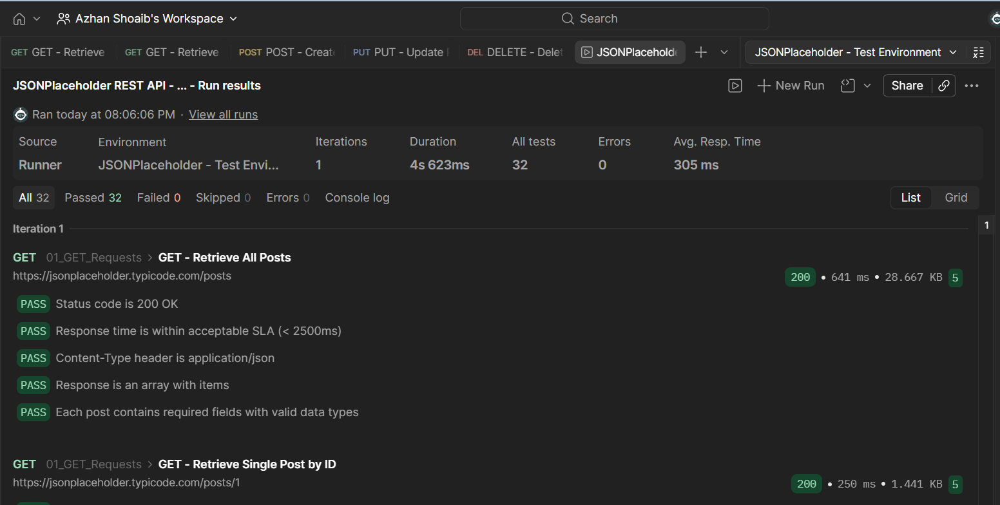

**Middle Set of Requests (PUT & PATCH Requests):**
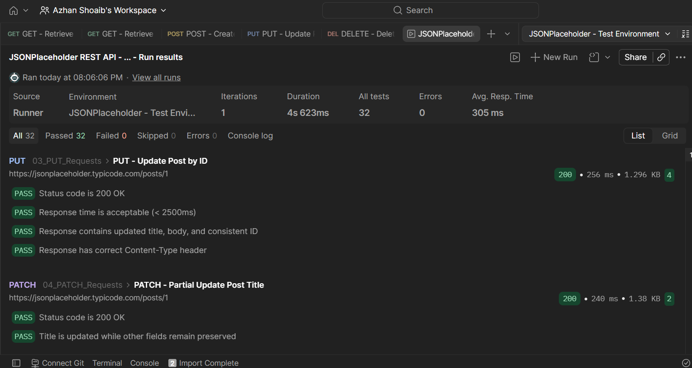

**Full Run Overview:**
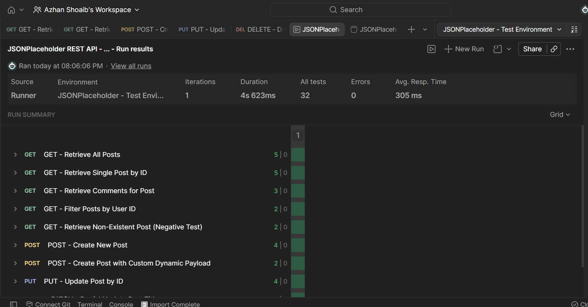

---

## 📋 4. Summary Table of Test Results

| Request Name | Method | Endpoint | Status Code | Total Tests | Passed | Failed |
| :--- | :---: | :--- | :---: | :---: | :---: | :---: |
| **GET All Posts** | `GET` | `/posts` | `200 OK` | 5 | 5 | 0 |
| **GET Single Post by ID** | `GET` | `/posts/1` | `200 OK` | 5 | 5 | 0 |
| **GET Comments for Post** | `GET` | `/posts/1/comments` | `200 OK` | 3 | 3 | 0 |
| **GET Filter Posts by User** | `GET` | `/posts?userId=1` | `200 OK` | 2 | 2 | 0 |
| **GET Non-Existent Post** | `GET` | `/posts/99999` | `404 Not Found` | 2 | 2 | 0 |
| **POST Create New Post** | `POST` | `/posts` | `201 Created` | 4 | 4 | 0 |
| **POST Dynamic Payload** | `POST` | `/posts` | `201 Created` | 2 | 2 | 0 |
| **PUT Update Post by ID** | `PUT` | `/posts/1` | `200 OK` | 4 | 4 | 0 |
| **PATCH Partial Update** | `PATCH` | `/posts/1` | `200 OK` | 2 | 2 | 0 |
| **DELETE Post by ID** | `DELETE`| `/posts/1` | `200 OK` | 3 | 3 | 0 |
| **TOTAL** | | | | **32** | **32** | **0** |

---

## 🎯 Conclusion

All functional API test requirements for Postman have been completely verified and proven with screenshots. The API handles all standard CRUD operations cleanly, respects REST standards, returns expected status codes, and passes 100% of automated test assertions.
